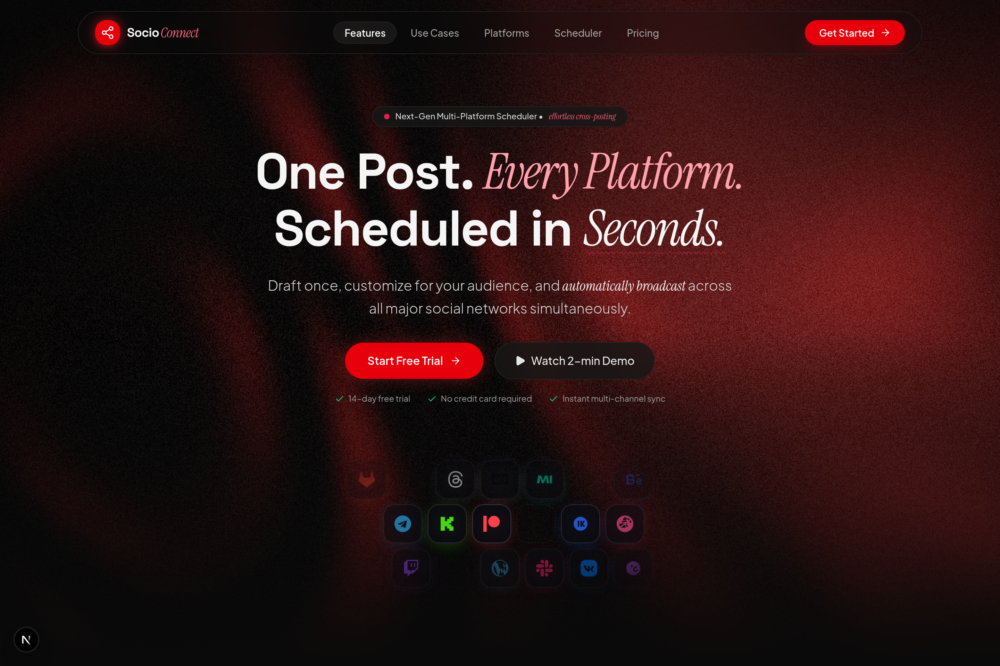

<div align="center">

# SocioConnect

**The Next-Generation Omnichannel Content Orchestration & Automation Engine**

_One Post. Every Platform. Scheduled in Seconds._

[](https://nextjs.org/)
[](https://bun.sh/)
[](https://hono.dev/)
[](https://www.typescriptlang.org/)
[](https://orm.drizzle.team/)
[](https://turbo.build/)

<br />

<p align="center">
  
</p>

</div>

---

## 🌟 Overview

**SocioConnect** is a unified, high-performance content orchestration platform designed to broadcast, automate, and synchronize content across **40+ destinations** simultaneously.

From short-form microblogs (X, Threads, Bluesky) to developer communities (Reddit, Discord, GitHub), video channels (YouTube, TikTok, Twitch), and long-form publishing platforms (Medium, Substack, Dev.to, Hashnode), SocioConnect handles character limits, media encoding, archetype-specific formatting, and rate-limit backoffs automatically.

---

## ✨ Key Features

- **🌐 40+ Native Platform Integrations**:
  - **Social & Microblogs**: X (Twitter), Threads, Bluesky, Mastodon, Warpcast, Nostr, VK, MeWe, LinkedIn, Facebook.
  - **Publishing & Long-Form**: Medium, Dev.to, Hashnode, WordPress, Ghost, Substack, Beehiiv, Tumblr, Listmonk.
  - **Video & Clips**: YouTube, TikTok, Twitch, Kick.
  - **Developer & Products**: GitHub, GitLab, Product Hunt, Notion.
  - **Community & Messaging**: Reddit, Telegram, WhatsApp, Discord, Slack, Lemmy, Skool, Whop, Hacker News.
  - **Visual & Audio**: Pinterest, Dribbble, Behance, Spotify.

- **✍️ Universal Omnichannel Composer**:
  - Write once with a single master draft, then fine-tune dialect, hashtags, and formatting per platform tab.
  - Archetype-specific controls (Article titles, canonical SEO links, YouTube visibility & kids flags, Subreddit pickers, Telegram silent broadcast).
  - Real-time **Intelligent Platform Compatibility Engine** warning of constraint violations before dispatch.

- **☁️ Direct-to-Cloudflare R2 Media Storage**:
  - Secure presigned PUT uploads direct from browser to Cloudflare R2 for instant upload speeds.
  - Automated MIME classification and format validation using `@repo/storage`.

- **⚡ Autonomous Workflows & Pipelines**:
  - Automatically convert RSS updates, GitHub release tags, and Substack newsletters into multi-network broadcast chains.

- **🎨 Obsidian Dark UI Experience**:
  - Crafted with Next.js 16, Tailwind CSS, Framer Motion, and custom animated platform components.

---

## 🏛️ Monorepo Architecture

```text
socioconnect/
├── apps/
│   ├── web/                    # Next.js 16 (Turbopack) Obsidian Web Application
│   │   ├── app/                # App Router (Landing, Dashboard, Sitemap, Robots)
│   │   ├── component/          # Landing & Dashboard UI (Composer, Connectors, Automations)
│   │   └── context/            # Authentication, Theme & Toast notification state
│   └── api/                    # Bun + Hono REST API & Dispatch Orchestrator
│       ├── src/modules/        # Auth, OAuth, Posts, Connectors, Providers
│       └── src/routes/         # OpenAPI routes & Swagger/Scalar docs
│
├── packages/
│   ├── storage/                # Cloudflare R2 Presigned S3 client & MIME normalization
│   ├── libraries/              # 28+ Modular Platform Providers & Validation Rules
│   ├── contracts/              # Shared Zod Schemas & DTO contracts
│   ├── db/                     # PostgreSQL schemas & Drizzle ORM migrations
│   ├── shared/                 # Logging (Pino + Loki), encryption, rate limiting
│   └── config/                 # Environment schemas & constants
│
├── assets/
│   └── screenshots/            # High-DPI UI preview captures
│
└── infra/
    └── monitoring/             # Prometheus, Grafana, and Loki configs
```

---

## 🚀 Quick Start

### Prerequisites

- [Bun](https://bun.sh/) v1.3+
- [Docker](https://www.docker.com/) & Docker Compose
- [Node.js](https://nodejs.org/) v20+

### Installation

```bash
# 1. Clone repository
git clone https://github.com/itstheanurag/socioconnect.git
cd socioconnect

# 2. Install dependencies across workspaces
bun install

# 3. Setup environment variables
cp apps/api/.env.example apps/api/.env
cp apps/web/.env.example apps/web/.env.local

# 4. Start backing services (PostgreSQL + Observability)
docker compose -f docker-compose.dev.yml up -d

# 5. Run database migrations
bun run db:migrate

# 6. Start development server
bun run dev
```

### Access Points

| Service                  | URL                                                      | Description                  |
| :----------------------- | :------------------------------------------------------- | :--------------------------- |
| **Frontend Web App**     | [http://localhost:3000](http://localhost:3000)           | Next.js Landing & Dashboard  |
| **Backend REST API**     | [http://localhost:8000](http://localhost:8000)           | Hono API Gateway             |
| **Interactive API Docs** | [http://localhost:8000/docs](http://localhost:8000/docs) | Scalar OpenAPI Documentation |
| **Grafana Dashboard**    | [http://localhost:8001](http://localhost:8001)           | Metrics & Loki Telemetry     |
| **Prometheus**           | [http://localhost:9090](http://localhost:9090)           | System & Dispatch Metrics    |

---

## 🛠️ CLI Commands

```bash
# Development
bun run dev                     # Start all workspace services concurrently
bun run dev --filter=web        # Start web frontend only
bun run dev --filter=@repo/api  # Start backend API only

# Build & Quality
bun run build                   # Full monorepo production build
bun run typecheck               # TypeScript verification across all packages
bun run lint                    # ESLint verification

# Database
bun run db:generate             # Generate Drizzle schema migrations
bun run db:migrate              # Apply migrations to database
```

---

## 🔒 Security & Reliability

- **PKCE OAuth 2.0 Flow**: Google & multi-provider OAuth with `HttpOnly`, `SameSite=Lax` cookie sessions.
- **AES-256-GCM Encryption**: Platform access tokens and client secrets encrypted at rest in PostgreSQL.
- **Resilient Rate Limiting**: Exponential backoff and token bucket dispatch queues per destination platform.
- **Direct Presigned Uploads**: Zero media bytes touch backend servers; uploads stream directly to Cloudflare R2.

---

## 📜 License

This project is licensed under the MIT License.
